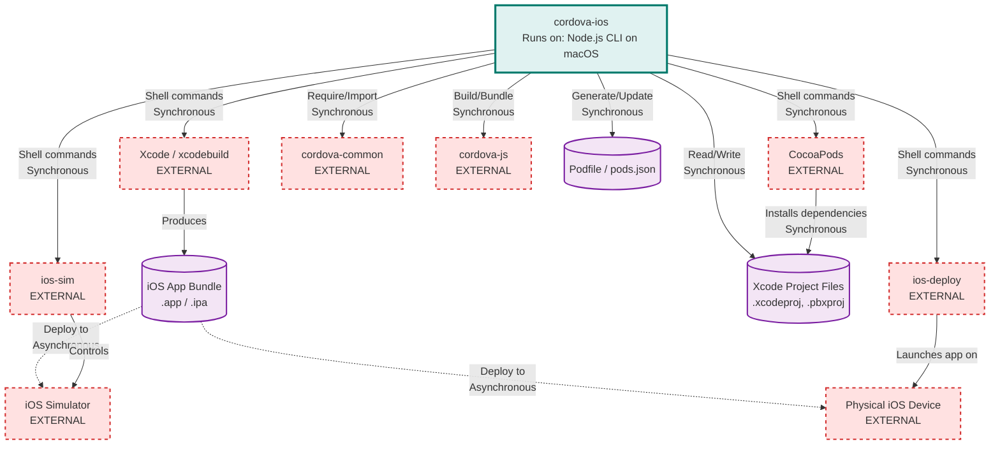

# Cordova-iOS Architecture

> **Repository:** cordova-ios
> **Runtime Environment:** CLI Tool / Build System (Node.js on macOS)
> **Last Updated:** 2026-02-02

## Overview

Cordova-iOS is a platform implementation that enables building iOS applications from web-based Cordova projects. It runs as a Node.js CLI tool on macOS and orchestrates the creation, building, and deployment of hybrid iOS apps using Xcode tooling and native iOS frameworks.

## Architecture Diagram

## External Integrations

| External Service | Communication Type | Purpose |
|------------------|-------------------|---------|
| xcodebuild (Xcode) | Sync (Shell exec) | Build iOS apps, archive, export IPA files |
| ios-deploy | Sync (Shell exec) | Deploy and launch apps on physical iOS devices |
| CocoaPods | Sync (Shell exec) | Manage native iOS dependencies from plugins |
| ios-sim | Sync (Shell exec) | Control iOS Simulator instances |
| iOS Simulator | Async (via ios-sim) | Run and test iOS apps in simulator environment |
| Physical iOS Device | Async (via ios-deploy) | Deploy and run apps on real devices |
| cordova-common | Sync (npm require) | Shared Cordova utilities (ConfigParser, PluginManager, events) |
| cordova-js | Sync (npm require) | Generate platform-specific cordova.js bridge |
| node-xcode | Sync (npm require) | Parse and manipulate Xcode project files programmatically |

## Architectural Tenets

### T1. Platform API as Entry Point

All platform operations must go through the standardized PlatformApi interface defined in `/Users/ben.mccarty/Code/cordova-ios/lib/Api.js`. This provides a consistent contract for Cordova CLI to interact with the iOS platform regardless of internal implementation details.

**Evidence:**
- `/Users/ben.mccarty/Code/cordova-ios/lib/Api.js` (in `Api` class) - Exports standardized methods: `createPlatform`, `prepare`, `addPlugin`, `removePlugin`, `build`, `run`, `clean`
- `/Users/ben.mccarty/Code/cordova-ios/package.json` (line 6) - Declares `"main": "lib/Api.js"` as entry point
- `/Users/ben.mccarty/Code/cordova-ios/lib/Api.js` (line 212) - All operations delegate to specialized modules (prepare, build, run) but orchestrate through Api class

### T2. Xcode Project as Source of Truth

The Xcode project file (.pbxproj) is the authoritative source for project configuration. All modifications to native project structure, build settings, and resource references must be persisted to the Xcode project file using the xcode npm library.

**Evidence:**
- `/Users/ben.mccarty/Code/cordova-ios/lib/projectFile.js` (in `parseProjectFile`) - Centralizes all Xcode project parsing through xcode library
- `/Users/ben.mccarty/Code/cordova-ios/lib/projectFile.js` (lines 65-73) - Provides `write()` method that ensures atomic writes to .pbxproj file
- `/Users/ben.mccarty/Code/cordova-ios/lib/plugman/pluginHandlers.js` - All plugin installation operations call `project.xcode.addFramework()`, `project.xcode.addResourceFile()` etc.
- `/Users/ben.mccarty/Code/cordova-ios/lib/projectFile.js` (line 27) - Implements caching to prevent multiple parses of same project

### T3. Plugin Operations Are Idempotent and Reversible

Plugin installation and uninstallation must be symmetric operations. Each handler in pluginHandlers must have both install and uninstall implementations that cleanly reverse each other without leaving artifacts.

**Evidence:**
- `/Users/ben.mccarty/Code/cordova-ios/lib/plugman/pluginHandlers.js` (lines 32-93) - Every handler type (source-file, header-file, resource-file, framework) defines paired install/uninstall functions
- `/Users/ben.mccarty/Code/cordova-ios/lib/plugman/pluginHandlers.js` (lines 24-29) - Framework whitelist prevents accidental removal of core iOS frameworks
- `/Users/ben.mccarty/Code/cordova-ios/lib/Api.js` (lines 270-276) - Plugin addition includes CocoaPods spec handling that must be reversible
- `/Users/ben.mccarty/Code/cordova-ios/lib/projectFile.js` (lines 67-70) - Framework tracking in frameworks.json enables reference counting for shared dependencies

### T4. Native Bridge Communication Through WKWebView Message Handlers

All communication between JavaScript web context and native iOS code must flow through the WKWebView message handler interface. This enforces security boundaries and enables structured command/callback patterns.

**Evidence:**
- `/Users/ben.mccarty/Code/cordova-ios/cordova-js-src/exec.js` (line 115) - JavaScript side posts commands via `window.webkit.messageHandlers.cordova.postMessage(command)`
- `/Users/ben.mccarty/Code/cordova-ios/CordovaLib/Classes/Private/Plugins/CDVWebViewEngine/CDVWebViewEngine.m` - WKWebView engine registers message handlers for bridge communication
- `/Users/ben.mccarty/Code/cordova-ios/cordova-js-src/exec.js` (lines 106-108) - All plugin calls are serialized with callbackId, service, action, and args
- `/Users/ben.mccarty/Code/cordova-ios/cordova-js-src/exec.js` (lines 118-124) - Native responses route back through `nativeCallback` with status codes

### T5. Separation of Build Logic from Runtime Logic

Build-time operations (project manipulation, code generation, resource copying) must remain separate from runtime plugin behavior. Node.js modules in `/lib/` handle build tasks, while Objective-C code in `/CordovaLib/` handles app runtime.

**Evidence:**
- `/Users/ben.mccarty/Code/cordova-ios/lib/` - Contains 18 JavaScript modules for CLI operations (build, prepare, create, run)
- `/Users/ben.mccarty/Code/cordova-ios/CordovaLib/Classes/` - Contains Objective-C runtime classes (CDVViewController, CDVPlugin, CDVWebViewEngine)
- `/Users/ben.mccarty/Code/cordova-ios/lib/prepare.js` (lines 51-76) - Build-time preparation updates project structure and copies web assets
- `/Users/ben.mccarty/Code/cordova-ios/CordovaLib/Classes/Public/CDVPlugin.m` - Runtime plugin base class has no knowledge of build system

### T6. Dependency Management Through CocoaPods and Swift Package Manager

Native iOS dependencies must be declared in plugin.xml and materialized through CocoaPods (via Podfile) or Swift Package Manager. Direct framework bundling is deprecated in favor of declarative dependency management.

**Evidence:**
- `/Users/ben.mccarty/Code/cordova-ios/lib/Podfile.js` - Manages Podfile generation and parsing with token-based injection
- `/Users/ben.mccarty/Code/cordova-ios/lib/PodsJson.js` - Tracks installed pods in pods.json for idempotent operations
- `/Users/ben.mccarty/Code/cordova-ios/lib/SwiftPackage.js` - Handles Swift Package Manager dependencies
- `/Users/ben.mccarty/Code/cordova-ios/lib/plugman/pluginHandlers.js` (lines 33-34, 45-46) - Swift Package plugins bypass traditional file-based installation
- `/Users/ben.mccarty/Code/cordova-ios/lib/Podfile.js` (lines 385-386) - Executes `pod install` synchronously after Podfile updates

### T7. Tool Version Requirements Enforced Early

Platform tooling requirements (Xcode, iOS-deploy, CocoaPods) must be validated before attempting builds. This provides clear error messages rather than cryptic build failures.

**Evidence:**
- `/Users/ben.mccarty/Code/cordova-ios/lib/check_reqs.js` (lines 27-38) - Defines minimum versions: Xcode 15.0.0, ios-deploy 1.12.2, CocoaPods 1.16.0
- `/Users/ben.mccarty/Code/cordova-ios/lib/check_reqs.js` (lines 129-169) - `check_all()` validates all requirements before proceeding
- `/Users/ben.mccarty/Code/cordova-ios/lib/check_reqs.js` (lines 90-104) - Each tool check compares semantic versions and returns clear error messages
- `/Users/ben.mccarty/Code/cordova-ios/lib/build.js` (line 28) - Build operations call `check_reqs.run()` before invoking xcodebuild
